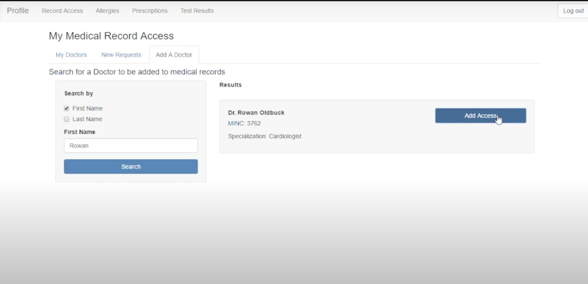
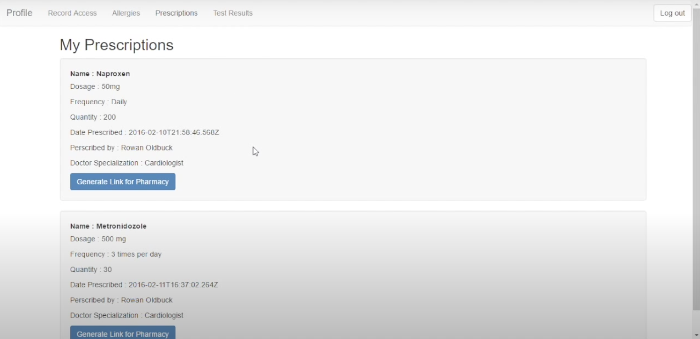
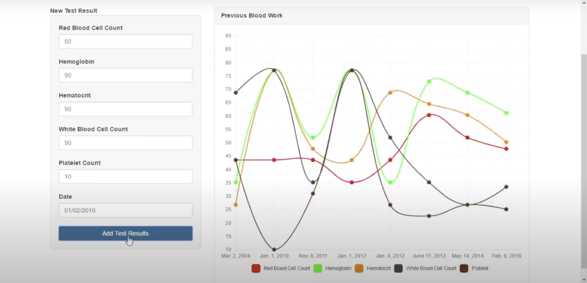

# Health.med
Node.js and MongoDB backend medical web application to facilitate the storing and sharing of patient information and records between medical professionals.

## Screenshots
 
 

## Motivation
This was a group thesis project completed in the last year of my degree. The goal was to create an application that would be used by both patients and doctors as a way to share and view medical records as well as keep track of medical history.

## Features
* Login option for both a patient and a doctor
* Patient can create a profile with details including their name, address, health card number, and contact information
* Ability for a patient to search and request a doctor and for the doctor to add patients
* Add medical test results and see a graphical view of results over time
* Can create a prescription and generate a link for the pharmacy
* Patients can add allergies and search for symptoms in database from WebMD
* Doctor can add notes and information about the patient during an appointment

## Challenges
* First time using the MEAN stack, lots to learn

## Things I Learned
* Learned the MEAN stack; how to create views, models, controllers, routes
* First time using a NoSQL database

## Future Improvements
* Ideally would want to be able to upload documents such as a XRay or other medical files
* Add a calender view for doctors to see their upcoming appointments
* Add a check to see if medication being prescribed conflicts with other medication that the patient is currently taking
